# 系统介绍

## 工作台

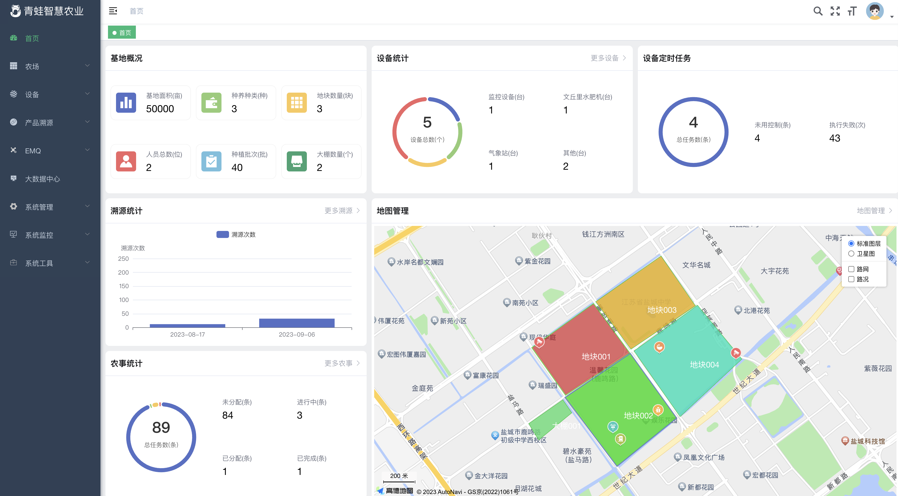

## 大屏

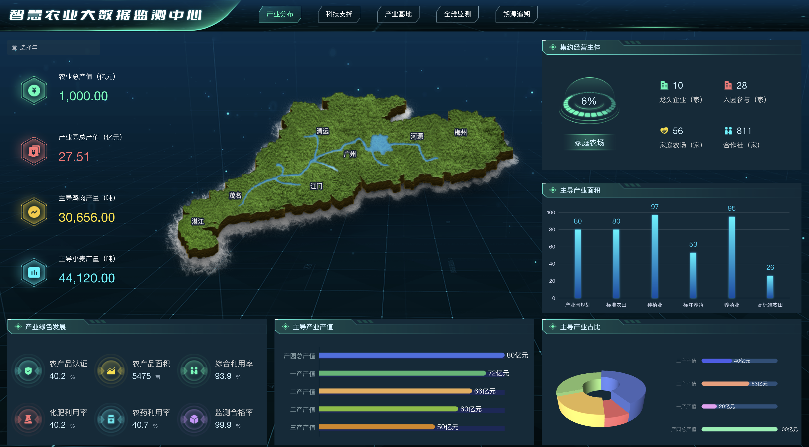

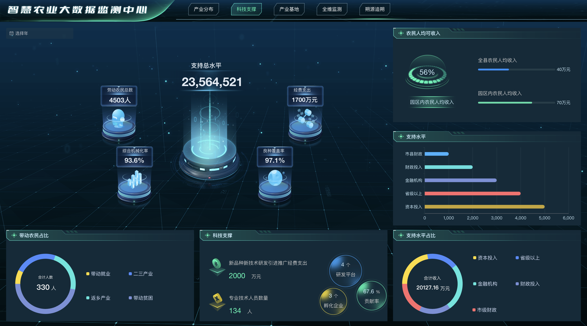

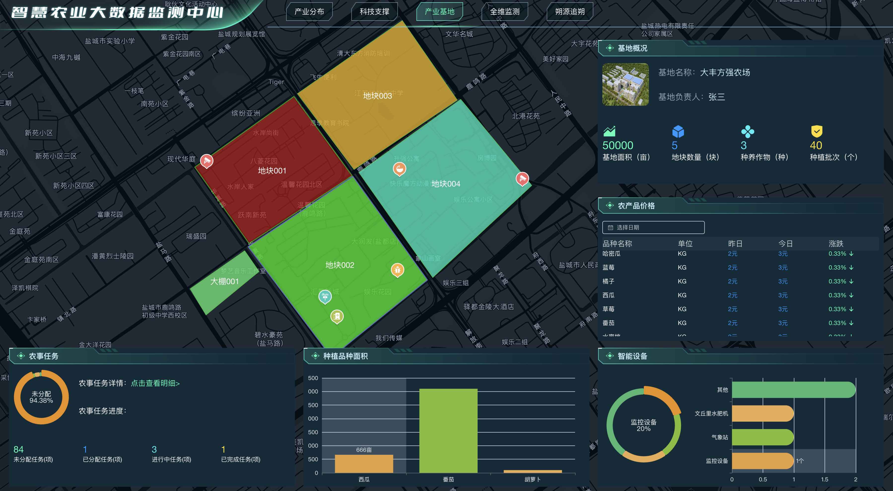

## 手机端

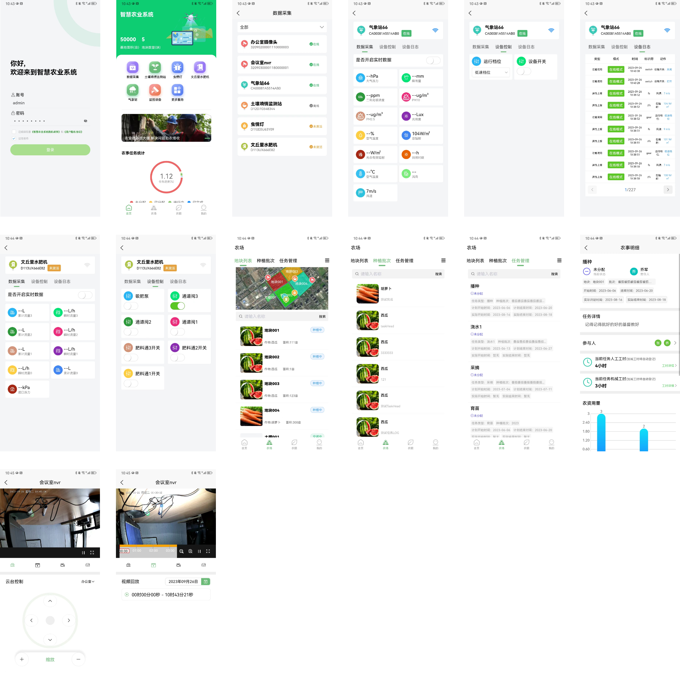

## 农场

农场包含：地图管理、员工管理、农机类别管理、农机信息管理、农资类别管理、农资信息管理、种质系统、地块管理、任务管理、农业资讯。

下面介绍一下特色功能。

### 地图管理

地图管理可以集中管理设备和地块信息，支持地块和设备检索定位，支持设备新增、编辑，支持地块的修改绘制。

### 地块管理

地块管理功能，支持地块绘制，支持边框颜色和透明度，支持覆盖区域颜色和透明度。

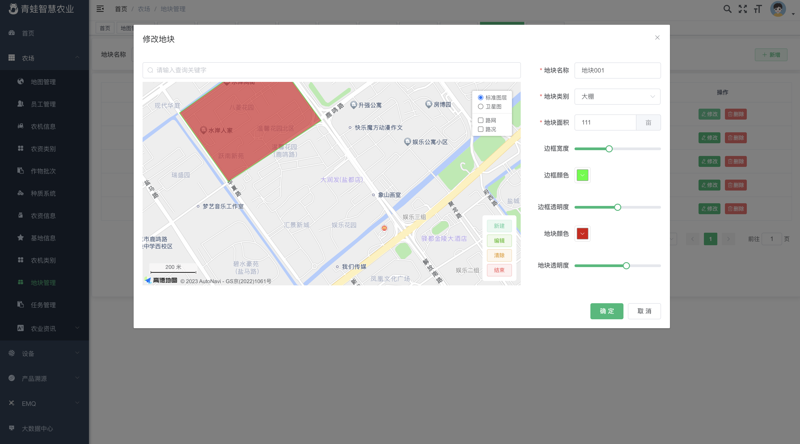

### 种质系统

种质系统支持维护种质信息，支持种植方法、种质介绍以及种质标准作业流程维护。

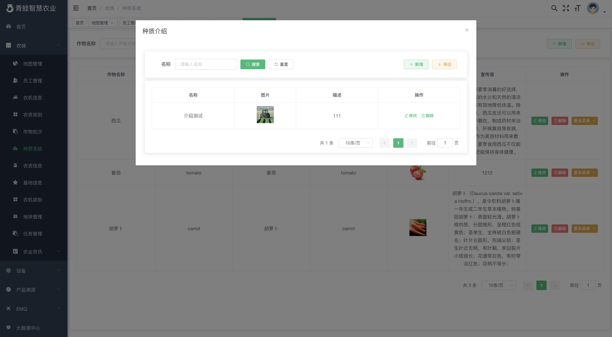

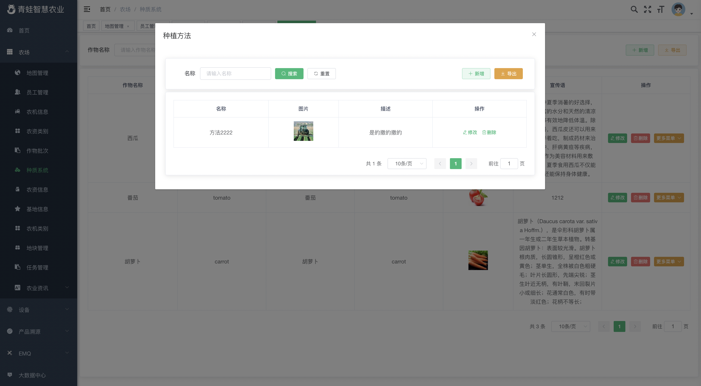

### 批次管理

新增批次，可按照种质标准任务生成批次任务。

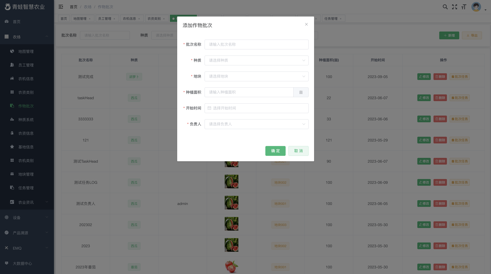

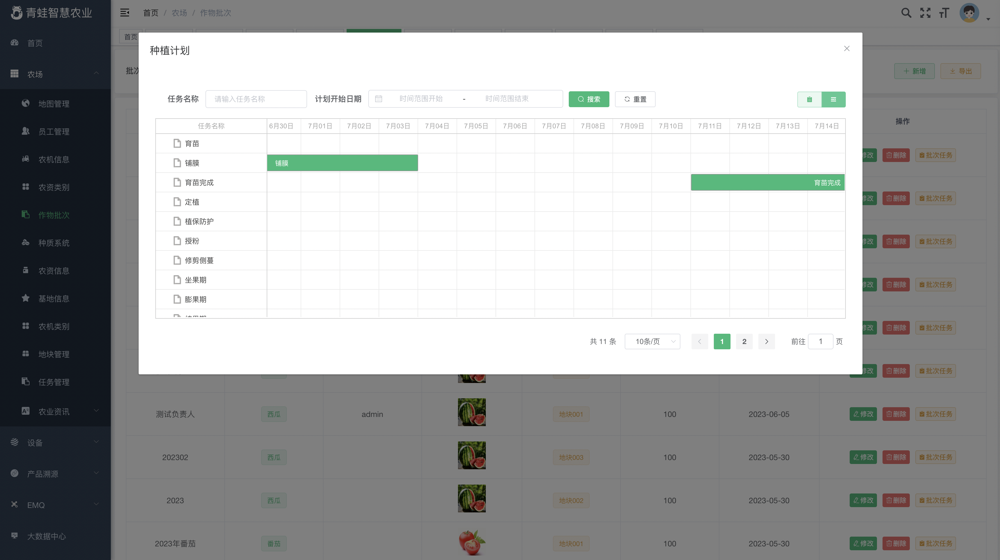

### 农事任务管理

支持按照批次查询任务。

任务支持甘特图预览模式。

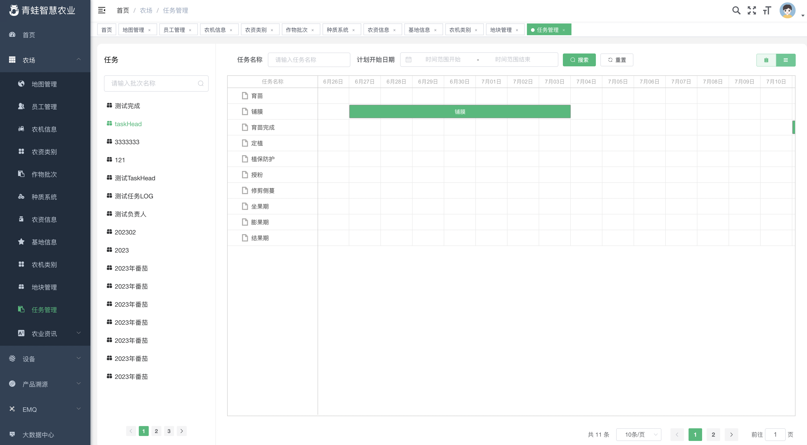

管理人员可以维护任务执行过程中的人员、工时、机械、农资、处理视频和图片等信息。

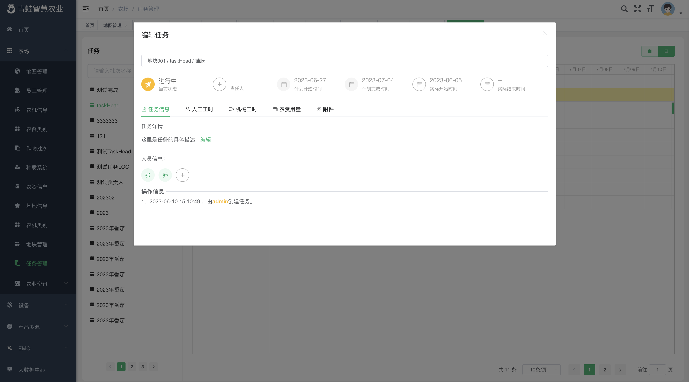

## 设备

### 物联网关设备

支持设备接入，设备通讯这块是系统配合网关进行通讯，网关支持TCP、UDP、MQTT、WebSocket、modbus等，几乎可以做到万物互联，同时支持可视化编程，实现自己的逻辑。

### 物模型

物模型功能将设备抽象为模型，主要分三种类型，设备属性、设备方法、设备事件。可实现设备属性上报、控制和事件触发。

### 产品管理

对同一类型的产品进行管理，产品支持物模型配置，认证配置。同时支持物联设备和摄像设备（IPC、NVR）等接入。

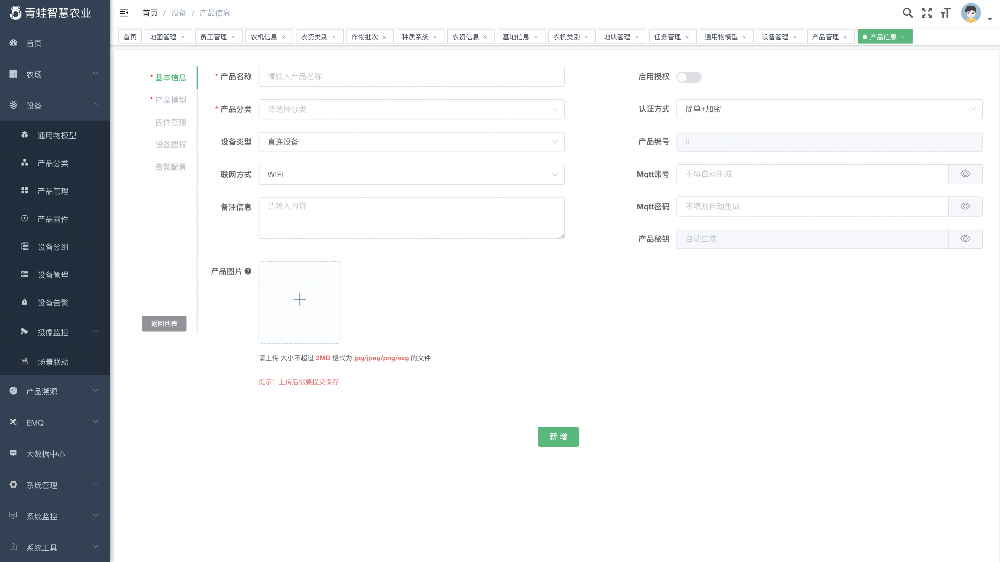

### 设备管理

可查看设备的在线等基本信息。

设备通用界面，支持拖拽布局，支持设备属性查看和设备控制，支持实时上报数据。

支持设备定时任务设置。

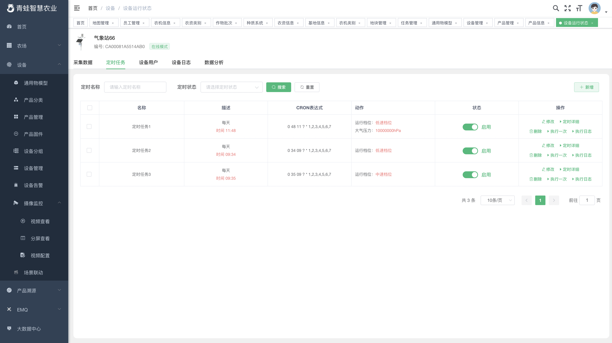

支持设备分享，多用户管理。

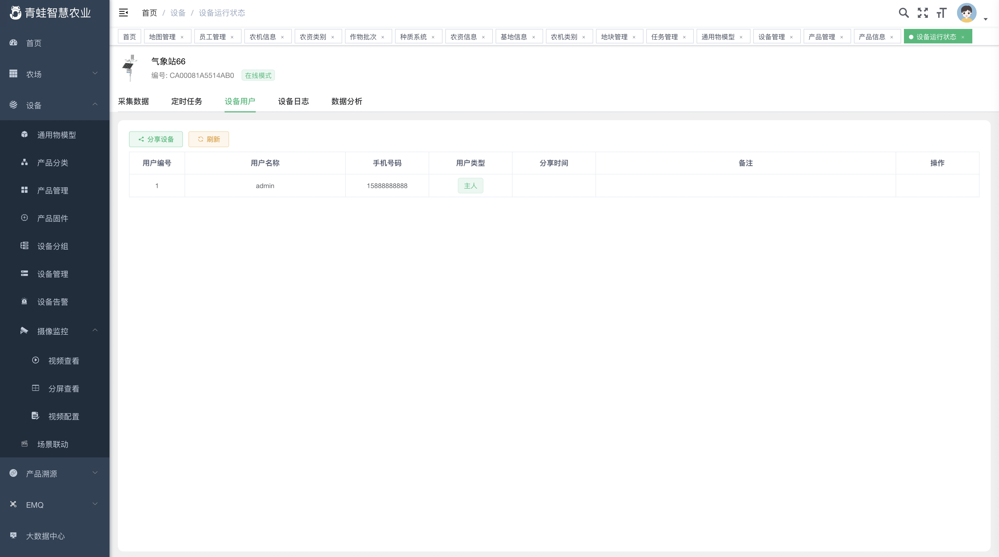

支持查看设备日志，日志类型有属性上报和设备控制。

支持对上报属性进行统计分析，形成报表。

### 其他设备管理界面

虫情灯

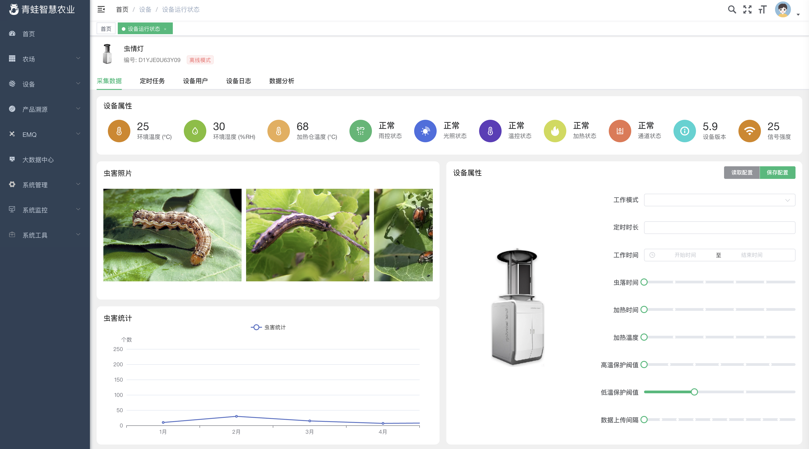

水肥机

### 场景联动

可以设置触发条件出发动作。

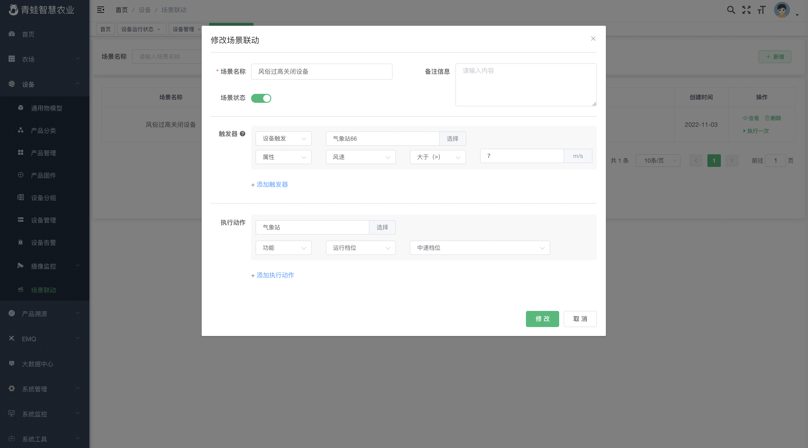

### 监控

根据国标GB28181-2016接入监控设备，实现设备方向、缩放、推流、回播等控制。测试延时500毫秒以内。

单屏

## 产品溯源

### 溯源产品

支持新建溯源产品，溯源产品关联产地、种质、地块、农事管理、监测设备等信息，方便溯源查询。

### 按种质查询溯源产品

### 溯源版本

溯源产品溯源码批次管理。

### 溯源h5

